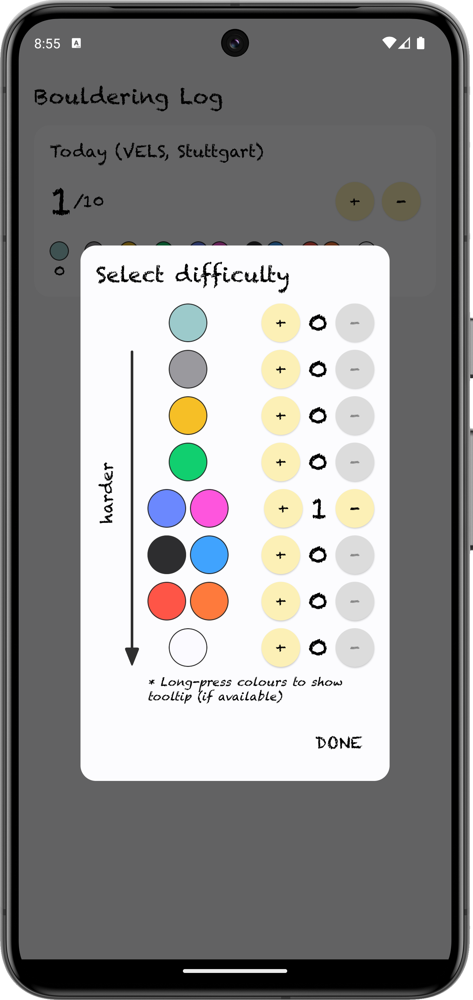

#  Bouldering Log

&emsp;

Native Android app for logging personal bouldering training sessions. Written in Kotlin with Jetpack Compose, Hilt, and coroutines in MVVM architecture. Available in English and German.

<table>
    <tbody>
        <tr>
            <td></td>
            <td></td>
            <td></td>
        </tr>
        <tr>
            <td></td>
            <td></td>
        </tr>
    </tbody>
</table>

## Credits

Designed and developed by [Li-Wei Yap](https://liweiyap.github.io/). The code within this app is Copyright © 2024 Li-Wei Yap and licensed under the [GNU General Public Licence v3.0](https://github.com/liweiyap/bouldertagebuch-android/blob/main/LICENSE). The code may ___not___ be reproduced without citation.

The heat-map calendar comes from an [open-source library](https://github.com/kizitonwose/Calendar) developed by Kizito Nwose.

The app icon was taken from www.flaticon.com and designed by [Freepik](https://www.freepik.com/).

 

    
    &ensp;
    

